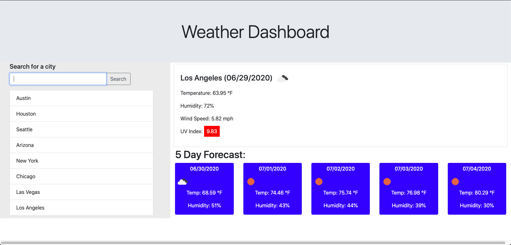
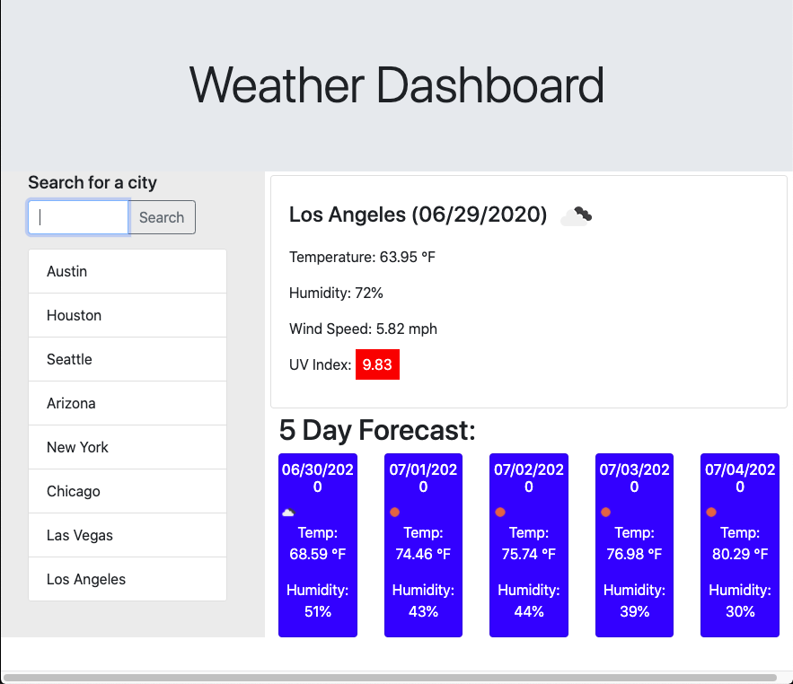

# Weather Dashboard

**[Project Link](https://omata48.github.io/HW6/)**

This project consisted of creating a web application that would allow a traveler who wants to see the weather outlook for multiple cities. The user is able to access this information for one city at a time in order to create travel plans. Additioanlly, they can always access previously searched for information by selecting a city from the "Search History".  

 

## Layout

The webpage was created with a simple layout: the title of the webpage, an aside, and the main content block. This was chosen in order to develop a clean display for the user to only focus on the weather data. The search aside contains the main user interaction. On this element, the user enters any city they want to search for, clicks on the "Search Button" and then is given the weather data pertaining to the city. Additionally, the aside element contains a temporary search history where the user can select a previously searched city to get the weather data from that city again.  

The layout was also created using [Bootstrap](https://getbootstrap.com/) in order to be able to generate a more mobile responsive application. When displaying the application on a vertical screen, the webpage aligns the elements vertically. This gives the user the title first, then the search field and then the main weather data followed by the cards containing the 5 day forecast.

## Function

The web page works by obtaining weather data for the city the user inputs from the [Open Weather API](https://openweathermap.org/api). To work with this API, I needed to craft query URL's based on the user's input that then retreived the latitude and longitude of the city the user wants the weather data for. With this additional information, we then create a second ajax query to the API that returns weather data for the current and next 8 days. We then parse this JSON data to retreive the information that is going to replace the contents of the HTML containers that we locate with jQuery. The weather icon is a changing image source that is determined by the icon ID given back from the API. The UV index is styled depending on the value given and the severity of the value. 

Additionally, I utilized the local storage of the users application in order to store the name of the last searched city. If the browser is then refreshed, the init() function searches for an item stored with the key "city". If there is one, it renders the weather history for that item; if there isn't an item, the page waits for input from the user.