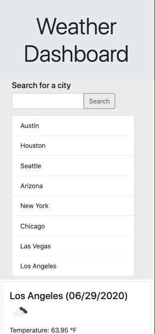

# Weather Dashboard

**[Link to Deployed Site](https://omata48.github.io/Weather-Dashboard/)**

## Description

Web application to view current and five day forecast for any city in the United States. Querying for a city keeps a history of previously searched cities. By selecting a city from the search history, users are able to quickly search for the city selected.

  

## Table of Contents

[Function](#Function)
[Usage](#Usage)  
[License](#License)  
[Contributing](#Contributing)  
[Questions](#Questions)  

## Function

Makes AJAX queries to the [Open Weather API](https://openweathermap.org/api) to retrieve weather data. Uses two calls in order to get the latitude and longitude of the city and then to get the forecast for the city chosen. Additionally, the API also passes the images used to show the weather as an icon.

Additionally, utilizes local storage to keep track of the search history. This is stored in the user's browser and is pulled from on refresh. If there is no items in the local storage, a default city is filled.

## Usage

While developing, you can open a preview of the webpage from your editor to your local browser (preferred Chrome to work with the developer tools).

You can also visit this link to visit the deployed version: [Site App](https://omata48.github.io/Weather-Dashboard/)

## License

Licensed under the [MIT license](LICENSE).

## Contributing

For any improvements, feel free to fork the code and submit a pull request.

## Questions

View my other projects on my [GitHub Profile](https://github.com/omata48)  
For additional questions feel free to email me at omata48@outlook.com
